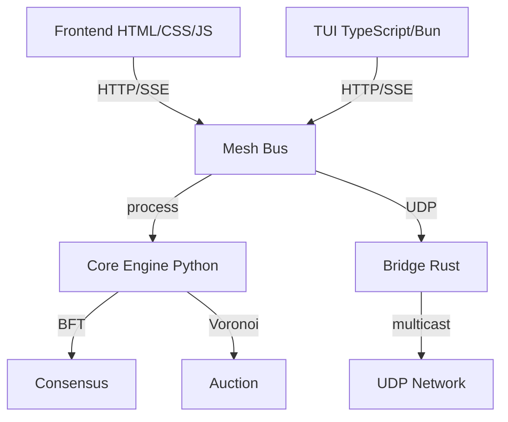
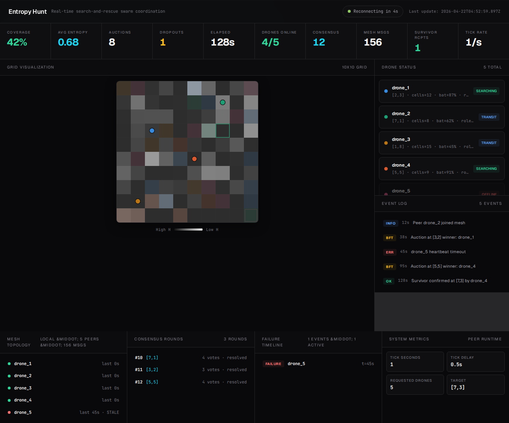
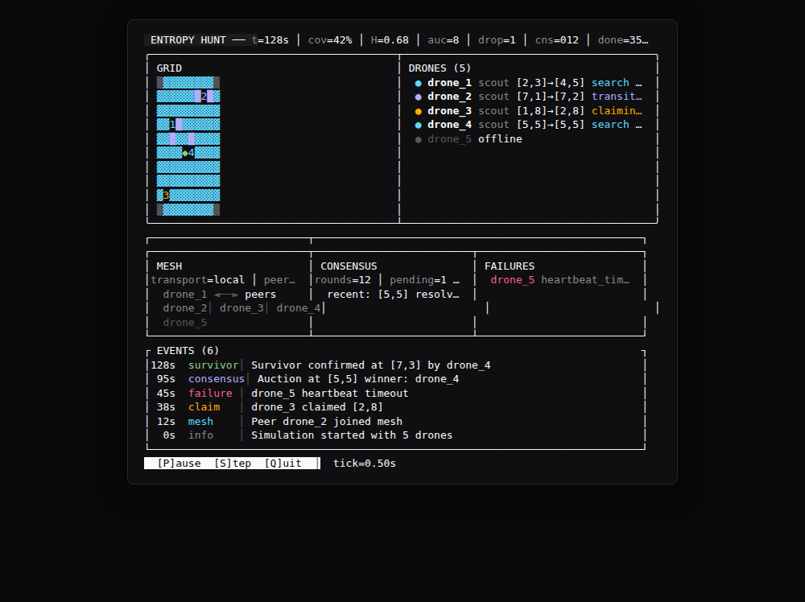
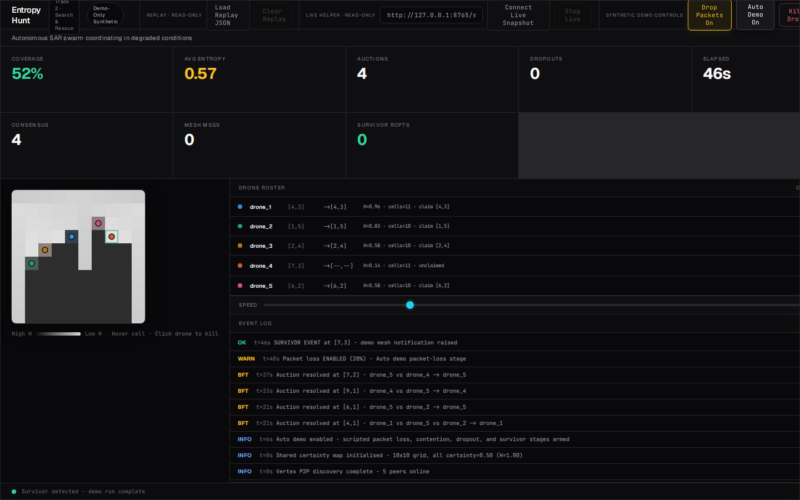

# Entropy Hunt

### Vertex Swarm Challenge 2026 · Track 2 · Search & Rescue

Autonomous drone swarm for disaster-zone SAR. Drones partition terrain via Voronoi cells, resolve conflicts through Byzantine-fault-tolerant consensus over a P2P mesh, and emit cryptographically signed coordination proofs.

[](https://github.com/symulacr/entropyhunt/actions)
[](https://python.org)
[](https://rust-lang.org)
[](https://bun.sh)

## Quickstart

```bash
git clone https://github.com/symulacr/entropyhunt && cd entropyhunt
cp .env.example .env
# Edit .env — set ENTROPYHUNT_MESH_SECRET to a strong secret
./setup.sh && ./demo.sh
```

## Demo

```bash
./demo.sh --duration 60 --drones 5 --grid 8     # standard swarm demo
./demo.sh --tui                                  # with TUI dashboard
python3 main.py --mode stub --packet-loss 0.3 --fail drone_2 --fail-at 15
```

## Architecture



| Layer | Tech | Role |
|:---|:---|:---|
| Frontend | HTML/CSS/JS | Mission control + live telemetry |
| TUI Monitor | TypeScript / Bun | Terminal dashboard (via `--tui`) |
| Core | Python 3.12+ | Consensus, auction, mesh buses, inline TUI |
| Bridge | Rust / tokio | HMAC endpoints, UDP multicast, peer registry |
| Sim | Webots / ROS2 | Physics-based validation |

## Track Compliance

| Requirement | Evidence |
|:---|:---|
| Autonomous terrain partitioning | `auction/voronoi.py` |
| BFT consensus | `core/consensus.py` |
| 30% failure resilience | `failure/network_injector.py` + demo |
| Cryptographic audit trail | `scripts/verify_poc.py` |
| P2P mesh transport | `core/mesh.py` — 4 bus implementations |
| ROS2 bridge | `ros2_ws/` QoS topics |
| Webots physics | `simulation/webots_controller.py` |
| Multi-language stack | Python + Rust + TypeScript |

## Screenshots

| Mission Control | Live Dashboard | TUI | Survivor Found |
|:---:|:---:|:---:|:---:|
|  |  |  |  |

## Config

| Variable | Purpose |
|:---|:---|
| `ENTROPYHUNT_MESH_SECRET` | HMAC key for mesh messages |
| `ENTROPYHUNT_HOST` | Bind address for peers |
| `ENTROPYHUNT_MQTT_HOST` / `PORT` | FoxMQ broker |
| `ENTROPYHUNT_TRANSPORT` | Backend: `local` or `foxmq` (use `--mesh real` for Vertex) |

Copy `.env.example` to `.env` and fill in values. Never commit `.env`.
